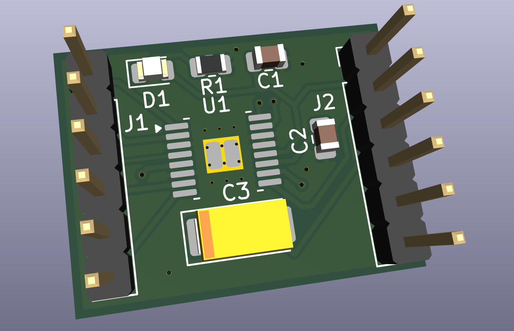
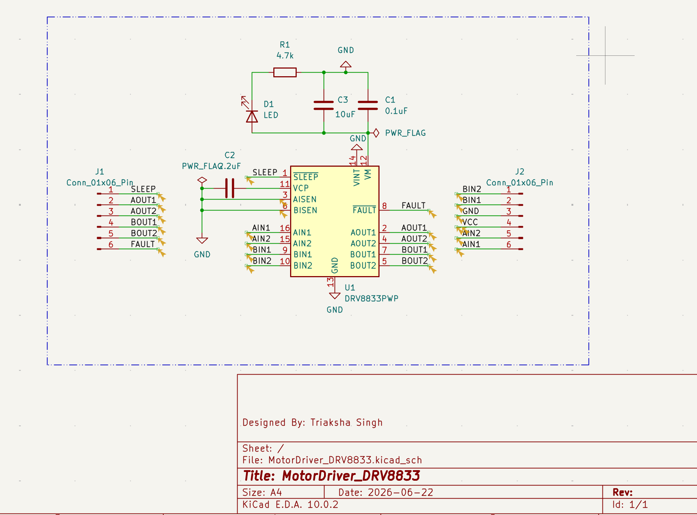

# DRV8833 Dual H-Bridge Motor Driver PCB

> Compact, two-channel brushed DC motor driver designed in KiCad — built for embedded robotics and motor control applications.

---

## PCB Layout

---

## Schematic

---

## Overview

This project is a custom PCB design centered around the **Texas Instruments DRV8833** — a dual H-bridge motor driver capable of controlling two brushed DC motors (or one stepper motor) independently. The board is designed to be small, clean, and easy to integrate into a larger system via standard 0.1" pin headers.

The design prioritizes simplicity and reliability: power decoupling is handled close to the IC, a status LED gives visual feedback on power state, and both the SLEEP and FAULT pins are broken out to the control connector so the host MCU has full control.

---

## Specifications

| Parameter | Value |
|---|---|
| Motor Driver IC | TI DRV8833PWP |
| Motor Channels | 2 (independent H-bridges) |
| Supply Voltage (VM) | 2.7 V – 10.8 V |
| Output Current (peak) | 1.5 A per channel |
| Control Interface | PWM / Phase-Enable via pin header |
| Sleep / Fault | Broken out to J1 connector |
| Status LED | Power-on indicator (D1) |
| Decoupling | 0.1 µF + 10 µF bulk capacitors |
| PCB Tool | KiCad EDA 10.0.2 |
| Form Factor | Compact, through-hole headers on both sides |

---

## Connectors

**J1 — Control (Input Side)**

| Pin | Signal | Description |
|---|---|---|
| 1 | AIN1 | Motor A direction input 1 |
| 2 | AIN2 | Motor A direction input 2 |
| 3 | BIN1 | Motor B direction input 1 |
| 4 | BIN2 | Motor B direction input 2 |
| 5 | SLEEP | Low = sleep mode (active low) |
| 6 | FAULT | Open-drain fault flag output |

**J2 — Output Side**

| Pin | Signal | Description |
|---|---|---|
| 1 | BOUT2 | Motor B output 2 |
| 2 | BOUT1 | Motor B output 1 |
| 3 | GND | Ground |
| 4 | VCC | Motor supply voltage |
| 5 | AOUT1 | Motor A output 1 |
| 6 | AOUT2 | Motor A output 2 |

---

## Bill of Materials

| Ref | Value | Description |
|---|---|---|
| U1 | DRV8833PWP | Dual H-bridge motor driver, HTSSOP-16 |
| C1 | 0.1 µF | Decoupling capacitor (MLCC) |
| C2 | 2.2 µF | Bulk decoupling capacitor |
| C3 | 10 µF | Additional bulk/bypass capacitor |
| R1 | 4.7 kΩ | Pull-up / current-limiting resistor |
| D1 | LED | Power indicator |
| J1 | Conn_01x06 | Control input connector |
| J2 | Conn_01x06 | Motor output connector |

---

## Project Files

| File | Description |
|---|---|
| `MotorDriver_DRV8833.kicad_sch` | KiCad schematic |
| `MotorDriver_DRV8833.kicad_pcb` | KiCad PCB layout |
| `MotorDriver_DRV8833.kicad_pro` | KiCad project file |

---

## Tools Used

- [KiCad EDA](https://www.kicad.org/) 10.0.2 — schematic capture and PCB layout
- Texas Instruments [DRV8833 Datasheet](https://www.ti.com/lit/ds/symlink/drv8833.pdf)

---

## Status
✅ Schematic complete  
✅ Layout complete  
✅ DRC passed (0 violations, 0 unconnected)  
⬜ Fabricated  
⬜ Tested  

---

## What I Learned
- IC footprint integration and decoupling cap placement
- Copper zone clearance tuning for dense SMD layouts
- H-bridge motor control theory and PWM interface

---

## Author

**Triaksha Singh**  
Designed: June 2026
